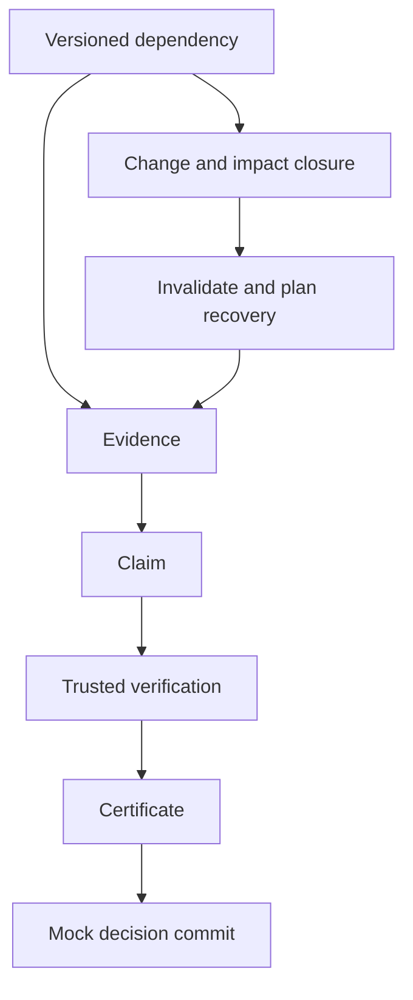

# Architecture

`src/cert_recovery/` contains small modules: `models`, `graph`, `certificates`,
`provenance`, `crypto`, `engine`, `metrics`, `config`, `data_pipeline`,
`model_pipeline`, `evaluation`, and future agent `interfaces`.

## Core rules
- Support → consumer edges bind exact ID/version pairs. IDs cannot change kind;
  logical cycles and missing supports are rejected.
- Dependency updates add versions; removal adds an untrusted tombstone.
  Consumers of **all earlier versions** are considered, including repeated changes before recovery.
- `invalidate_artifact` handles disputed evidence/intermediate claims; explicit
  certificate revocation is separate and cannot be automatically reversed.
- Every affected derived node is invalid until rebuilt. Certificates are reissued
  only after a registered task verifier passes with current support.
- A rebuilder receives old metadata and current supports. It must recompute its
  result. Missing recipes, failed checks, revoked authority and insufficient budgets block.
- Recovery is topological. Among ready nodes, prioritize downstream decision
  reach and then lower configured cost. No claim of optimal scheduling is made.
- `VALID → INVALID → PENDING_REVERIFICATION → SUPERSEDED` describes the old
  certificate during successful recovery; a **new** certificate becomes `VALID`.
  Reverification failure returns the old state to `INVALID`. `REVOKED` and
  `SUPERSEDED` are terminal. Recovery is an event, not a redundant state.
- `commit_decision` checks the entire current ancestry under the same lock as
  journal commit. It performs a mock action only. Epochs reject delayed issuance
  requests and stale recovery plans. Unaffected certificates retain validity.

## Integrity and limits
Artifact payloads are frozen JSON strings; access returns a copy. SHA-256 binds
complete artifact content and support references. Certificate dependency hashes
bind the subject ancestry. The append-only journal records creations, checks,
transitions, plans and commits. Historical statuses are preserved as events.

| Mechanism | Role / current status |
|---|---|
| Hash chain | Implemented. Ordered-event edit/reorder detection; truncation needs an independently retained length/head checkpoint. |
| Merkle tree | Design only. Useful for inclusion proofs at larger scale; no proof of completeness or truth by itself. |
| Digital signature | Protocol/design only. Future signing authenticates a retained checkpoint; key custody must be specified. |

An attacker controlling both journal and checkpoint can rewrite the history.
Hashes prove no semantic truth, source honesty, causal effect or missing-edge
completeness. Encoding is project JSON canonicalization, not full RFC 8785.
Verifiers, rebuilders, core process and dependency capture are trusted. No
Byzantine tolerance, durable storage, distributed atomicity or real external
action transaction is implemented. Direct graph/store mutation bypasses the core.

Graph reachability is a conservative impact set relative to recorded edges.
It does **not** establish the minimal true causal set. Certificate fingerprints
are integrity receipts for declared checks, not general proofs of AI correctness.
